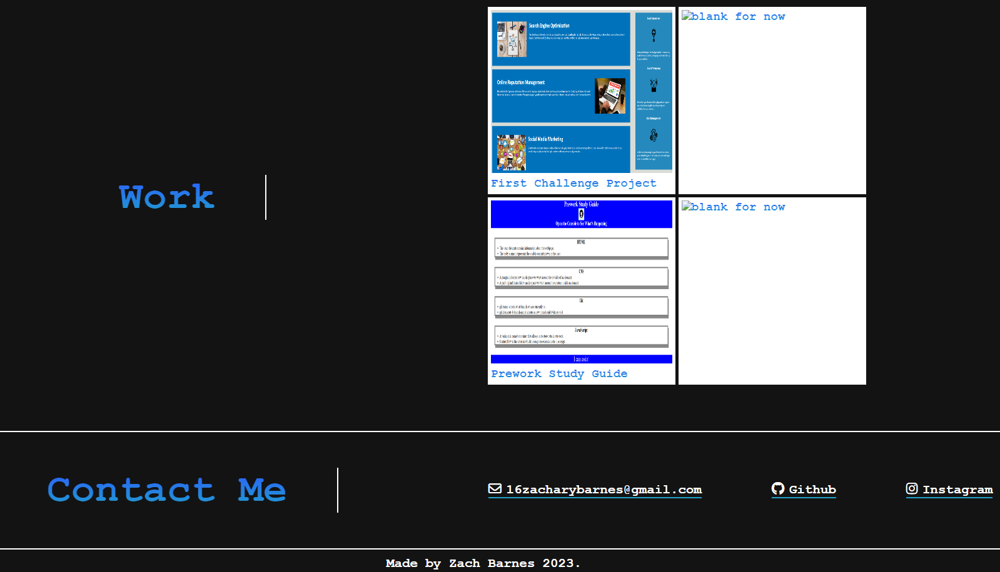

# Homework-Challenge-02

## Description

This is my second challenge project. The goal is to create an appealing portfolio to feature my future projects. Everything is commented and easy to understand for the viewer.

## Installation

Follow the link to Github and it will take you straight to the project.

## Usage

Click the items in the navbar to be taken to them, or scroll down and view. The website provides some of my previous github projects, how to contact me, and a little about myself. The resume will not be linked at this time.

Link to Deployed Application:
https://toosparky.github.io/homework-challenge-02/

## Credits

Zach Barnes personal Github - https://github.com/TooSparky

## License

No licenses